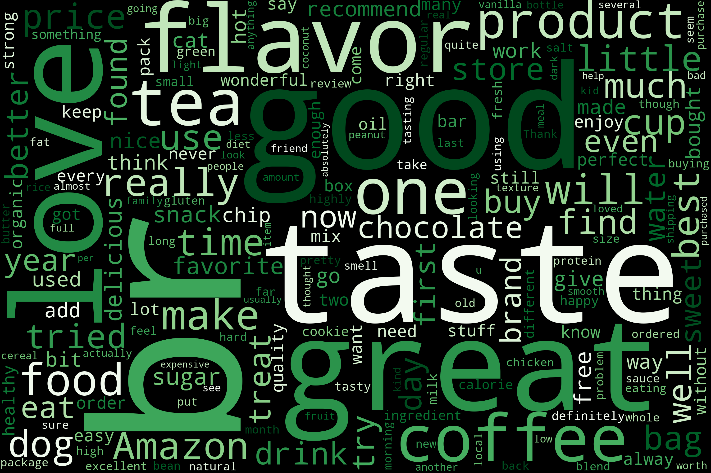
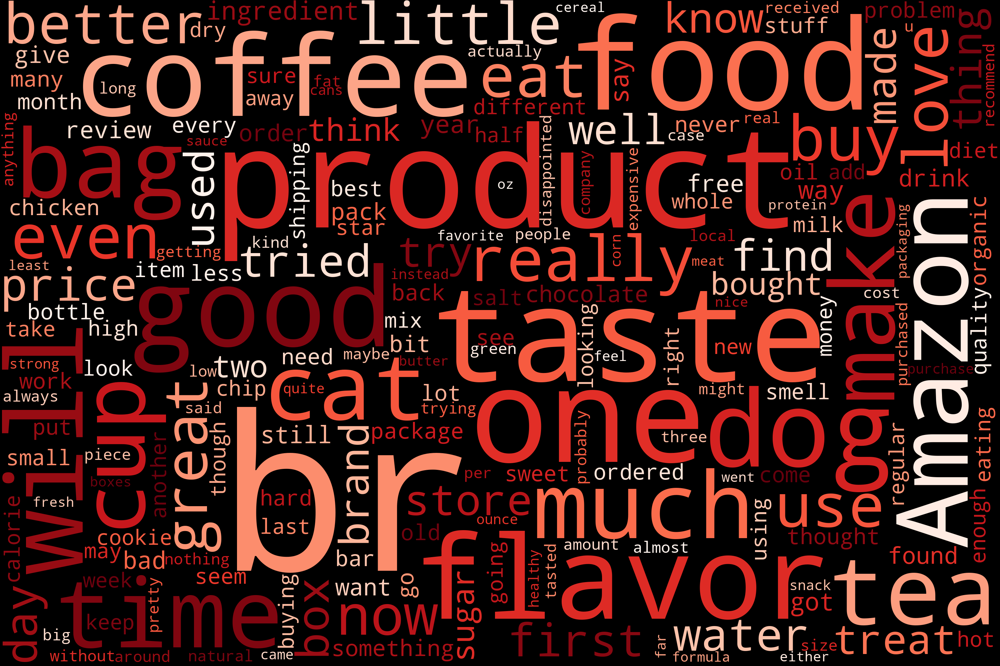
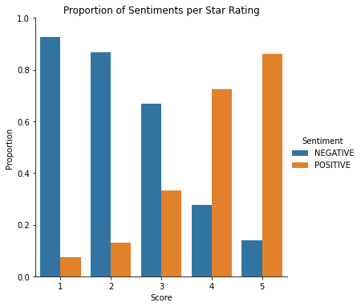

# Product-Reviews-Sentiment-Analysis

This project conducts a sentiment analysis on reviews of Amazon food products. The dataset is too large to be uploaded to this repository,
but it can be downlaoded from https://www.kaggle.com/snap/amazon-fine-food-reviews.

The objective of the project is to use a transformer model to calculate the sentiment of product reviews, either positive or negative, to add more information about whether the customer liked the product on top of the star rating they gave with the review.

Transformer models (GPT, BERT, BART, T5, etc.) are large language models trained on large amounts of text in a self-supervised fashion and can be fine-tuned for specific tasks in a supervised way. The model I used is called [distilbert-based-uncased-finetuned-sst-2-english](https://huggingface.co/distilbert-base-uncased-finetuned-sst-2-english) and is a distilled version of the BERT base model that is finetuned on the Stanford Sentiment Treebank (SST-2) dataset for sentiment analysis. The model is 60% faster, 40% lighter, and still retains 97% of BERT’s performance.

## Model Results

Below are the Word Clouds generated from positive and negative reviews. Both Word Clouds share a category of words that likely describe the products reviewed, such as *coffee*, *flavor*, *product*, and *food*. The Word Cloud of positive reviews has several words that one might expect to find, such as *good*, *great*, and *love*. The Word Cloud of negative reviews does not contain as many words with negative connotations as one might expect.

### Word Cloud of Positive Reviews

### Word Cloud of Negative Reviews

Compared to the star ratings, the proportions of positive and negative sentiments per star rating are as expected

## Conclusion
The Sentiment analysis on product reviews added more information about the nature of the reviews in tandem with the star ratings. Furthermore, the distilbert transformer model, finetuned for sentiment analysis, is effective at extracting the sentiment of text sequences. Although this dataset did not offer an opportunity to do so, text sentiment may be added as a useful feature to a predictive model.
